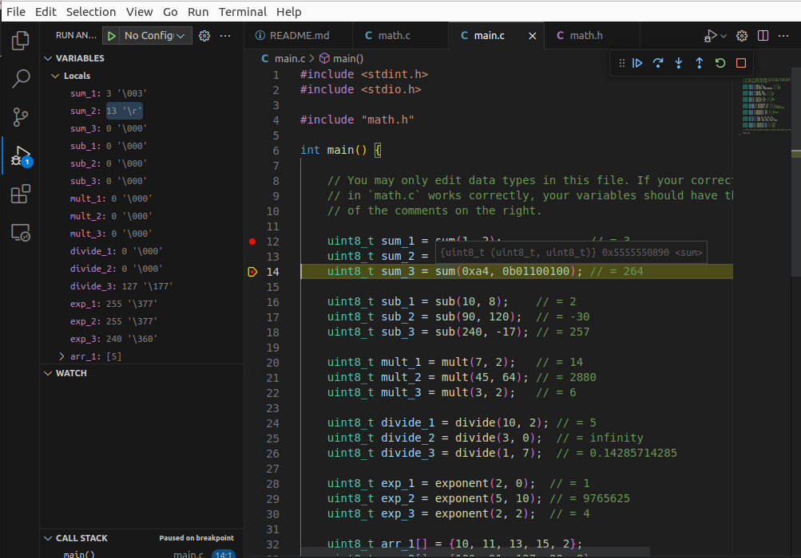
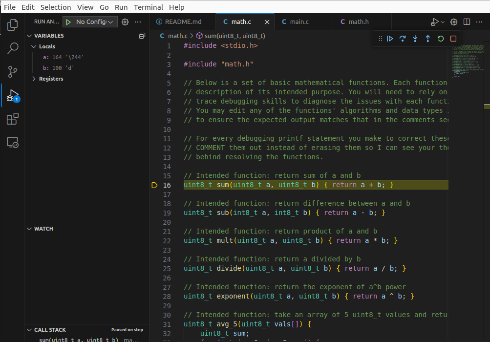
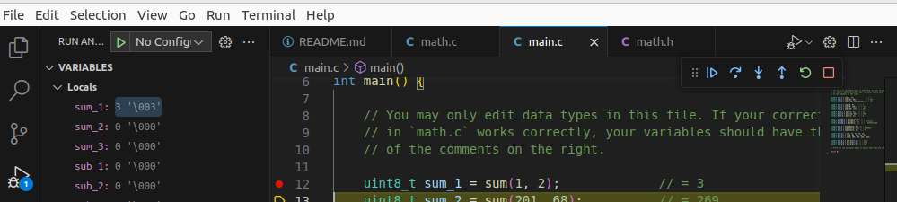
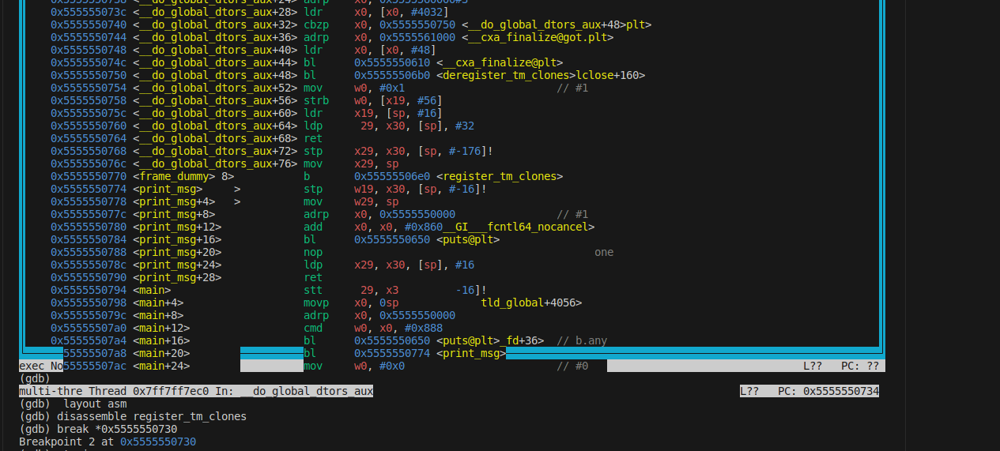
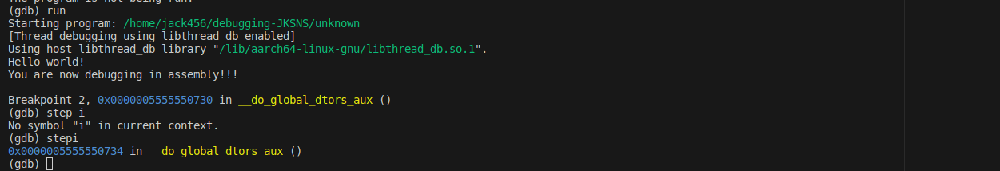
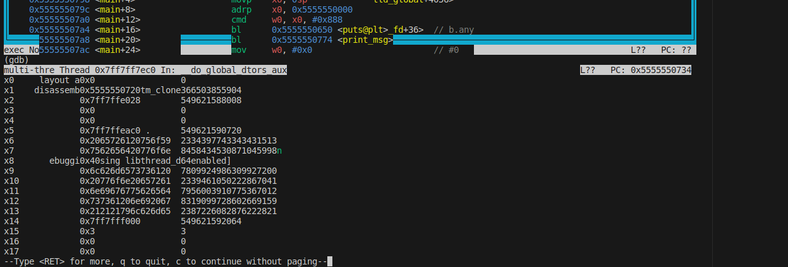

# Debugging

## Experience Summary

### How many hours did it take to complete the assignment?

1.5

### What did you enjoy about this lab?

I enjoyed learning more about different data types for specific use cases. 

### What were the major challenges you had with this lab? Try to be as detailed as possible.
One of the major challenges that I had in this lab was debugging in assembly. It took me much longer 
than I had expected to learn how to even make a breakpoint. I'm looking forward to developing this skill 
more. 
## Lab Specific Tasks

### Intentional and Incremental Programming

1. Why is intentional programming important?

Intentional programming is important because of its name: you bring intention into your programming. It's better for planning, productivity, resulting 
in faster, more efficient projects. Intential programming is specific to projects that you know how to complete and are 
comfortable doing. 

2. Why is incremental programming important?

Incremental programming is important becauase it helps you work through complex code and 
programs that you might not be comfortable and familiar with. It's more flexible, allowing 
you to break your program into sections using print statements for debugging. 

### Trace debugging

3. In the lab files for this repository, you will find three files of interest: `main.c`, `math.c`, `math.h`. Buggy functions have been included in the `math.c` file. Your job is to debug them using the trace debugging method and ensure that all of them work properly.

Done. 

4. Explain where each function went wrong and how you fixed it.

Sum: 
 
 
Problem: In the sum function, there's room for potential overflow when 'a+b' results in a number 
that's larger than 255. 
  
Solution: I changed the return type to a larger data type to account for numbers exceeding 255. 
      

Sub: 
 
  
Problem: 'int8_t' was being used for the input but returning 'uint8_t' which caused a negative result 
to be misinterpreted. 
  
Solution: By using 'int16_t' for the return type, we can accurately handle these cases. 
      

Mult: 
 
  
Problem: Exceeding the maximum value for 'uint8_t'.
  
Solution: I implemented a larger data type of 'uint16_t' to prevent overflow. 
      

Divide: 
 
  
Problem: Division by zero is not handled. 
  
Solution: I added a check clause for 'b==0' that would return 0 considering that case was true. 
      

Exponent: 
 
  
Problem: Uses bitwise XOR instead of calculating the exponent. 
  
Solution: I implemented an actual expontentiation algorthim in addition to adding 'uint64_t' as 
the data type to account for larger values. 
      

avg_5: 
 
  
Problems: The loop initializes outside of the array bounds. The loop condition is incorrect. 
THe variable 'sum' is used uninitialized. This function, overall, calculates the sum and not the mean. 
  
Solution: I corrected the loop to iterate properly from 0 to 4, initialized 'sum' to zero, and divided 
the final sum by five to get the average. 
      

### Using a Debugger

5. Take a screenshot of your breakpoint successfully working and call it `breakpoint.png`.

  

6. Take a screenshot of you stepping into a function that isn't in main.c `stepin.png`

  

7. Put a breakpoint in an area where a variable is being assigned a value. Take a screenshot of the debugging panel showing the variable value and call it `value.png`.

  

### Analyzing Assembly

8. Take a screenshot of setting a breakpoint in the assembly file and label it `asm_breakpoint.png`.

  

9. Take a screenshot of you using gdb to step to a different line in the assembly file and label it `asm_step.png`.

  

10. Print out the value of a register in the assembly file. If you get stuck on how to do this, do a little research on 'printing assembly registers gdb'. Take a screenshot and save it as `asm_print.png`.

  

### Reflection

11. Look up some `gdb` alternatives. List one and something different it does that `gdb` does not.

One 'gdb' alternative is 'LLDB', the default debugger for my Apple computer. This debugger, similar to other Apple software, 
is incredibly user friendly with excellent integration with popular IDEs. 